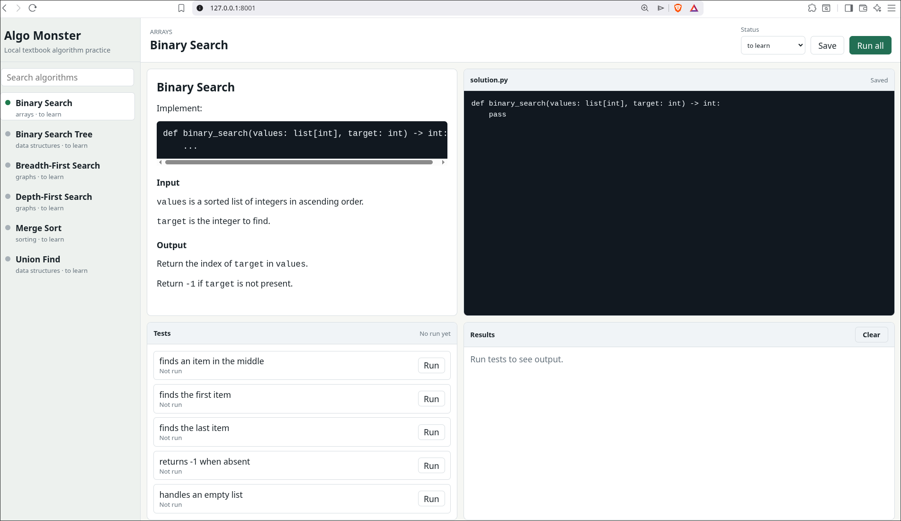

# Algo Monster Interview Prep

Algo Monster is a lightweight local web app for MLE interview prep. It consists of

 - algo monster: algorithm from scratch
 - mle monster: MLE intervew questions

## Algo Monster

Studying common algorithms by implementing them from scratch.

The app gives you a focused workspace with an algorithm prompt, an embedded
Python editor, visible test cases, and pass/fail feedback in one browser UI.

## Functionality

- Choose an algorithm from a preloaded study list.
- Read the algorithm prompt and expected behavior.
- Write a Python solution in the embedded editor.
- Review the available test cases.
- Run all test cases at once, or run one test case at a time.
- See pass/fail results and useful failure output.
- Track learning status manually as `to learn`, `learning`, or `learned`.
- See which algorithms currently pass their test cases.
- Keep personal progress and saved solutions locally.

## MLE monster

### Functionality

 - Choose an item to study, from one of the general categories:
   - ML fundamentals
   - Deep learning
   - LLM, AI 
   - Metrics Evaluation 
   - Data
   - Prductionization
   - Experimentation
 - For each item, you describe in your own words, feed to a LLM agent for evaluation,
   the agent gives you a score between 1-5. 1 being "you know nothing" and 5 being "you pass"
   - The LLM can either be a local LLM or chatgpt.
 - Your progress is automatically tracked, but you can always reset the progress at item level

## Usage

Algo Monster is intended to run locally on your machine.

1. Start the local app server:

   ```sh
   python3 server.py
   ```

2. Open the browser UI at `http://127.0.0.1:8000`. Select either algo monster or MLE monster

Algo monster:

1. Pick an algorithm from the list.
2. Implement the solution in Python.
3. Run the test cases and iterate until they pass.
4. Update the learning status when appropriate.



User-specific progress, settings, and saved solutions are stored under
`~/.config/algo_monster/`.

MLE monster:

 1. Pick an item to study
 2. Enter your own answer into the input box
 3. Click "grade me" to trigger an assessment. You will be given a score
 4. Review the "interview answer" box that is revealed after the assessment

## Requirements

Python 3.10 or newer is recommended. The MVP uses only the Python standard
library and does not require installing frontend or backend dependencies.
